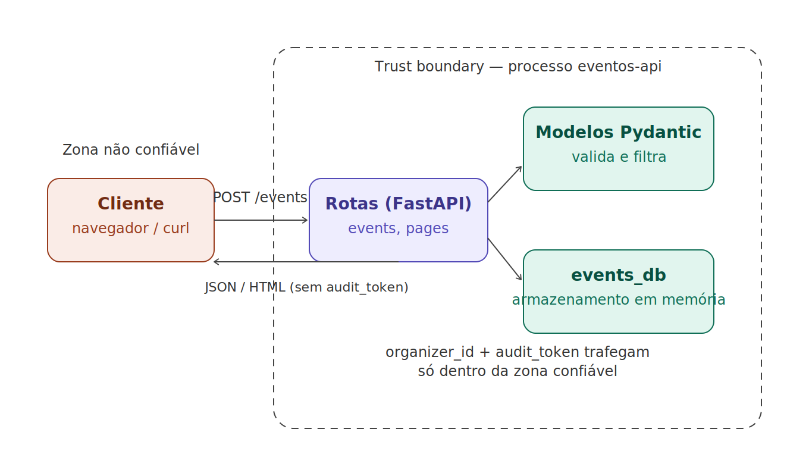

# Visão geral

Este relatório documenta as decisões técnicas tomadas na construção do `eventos-api`,
API REST em FastAPI, ao longo dos 8 exercícios do TP de Ambiente Seguro em Programação.
O código-fonte completo, organizado nos módulos `routes`, `models` e `database`
(Exercício 4), acompanha este relatório no arquivo `.zip` da entrega.

# Exercício 1 — Ambiente e primeira rota

**Decisão**: ambiente virtual criado com `venv` (equivalente ao `virtualenv` pedido,
nativo do Python 3), isolando as dependências do projeto do restante do sistema.
Dependências (`fastapi`, `uvicorn`) registradas em `requirements.txt` via `pip freeze`.

**Evidência — servidor no ar e rota `GET /` respondendo**:
```
$ curl http://127.0.0.1:8000/
{"status":"ok","service":"eventos-api"}
```

# Exercício 2 — Estrutura modular com APIRouter

**Decisão**: as rotas do recurso eventos foram isoladas em `app/routes/events.py`,
usando `APIRouter(prefix="/events")` e registradas em `main.py` via `include_router`.
`main.py` não conhece nenhum detalhe de implementação do domínio eventos.

Foram implementadas três operações RESTful: `GET /events/` (listar),
`POST /events/` (criar) e `GET /events/{id}` (obter por id).

**Justificativa**: separar routers por recurso evita que uma mudança em um domínio
quebre silenciosamente outro por estarem no mesmo arquivo — problema descrito no
enunciado (rota de pagamentos afetando notificações). Cada `APIRouter` isola as rotas
de um recurso; um novo desenvolvedor sabe exatamente onde adicionar um novo domínio
(criar um novo arquivo + `include_router`) sem tocar em código existente.

**Evidência**:
```
$ curl http://127.0.0.1:8000/events/1
{"id":1,"name":"Semana da Computacao","date":"2026-10-10","location":"Auditorio A"}

$ curl http://127.0.0.1:8000/events/
[{"id":1,"name":"Semana da Computacao","date":"2026-10-10","location":"Auditorio A"},
 {"id":2,"name":"Semana da Computacao","date":"2026-10-10","location":"Auditorio A"}]
```

# Exercício 3 — Controle de exposição de dados com response_model

**Decisão**: dois schemas Pydantic distintos — `EventPublic` (id, name, date, location)
e `EventInternal` (herda de `EventPublic` e adiciona `organizer_id` e `audit_token`).
O endpoint de criação usa `response_model=EventPublic`, e um endpoint adicional
(`POST /events/insecure-demo`) foi criado **apenas para fins de comparação**, sem
`response_model`, para demonstrar o vazamento.

**Comparação das respostas JSON** (mesmo payload de entrada em ambos):

Com `response_model=EventPublic`:
```
$ curl -X POST http://127.0.0.1:8000/events/ -H "Content-Type: application/json" \
  -d '{"name":"Semana da Computacao","date":"2026-10-10","location":"Auditorio A"}'
{"id":1,"name":"Semana da Computacao","date":"2026-10-10","location":"Auditorio A"}
```

Sem `response_model` (`/events/insecure-demo`):
```
{"id":2,"name":"Semana da Computacao","date":"2026-10-10","location":"Auditorio A",
 "organizer_id":42,"audit_token":"da67018d-ecbe-4986-a9ea-0cabc00fe7a1"}
```

**Dado sensível exposto e impacto**: sem `response_model`, a rota expõe `organizer_id`
(identificador interno do organizador) e `audit_token` (token de auditoria, que deveria
ser confidencial). Na prática, isso permite que qualquer cliente colete IDs sequenciais
de organizadores criando vários eventos e coletando os `organizer_id` retornados,
abrindo caminho para ataques de enumeração ou uso indevido do token de auditoria em
chamadas internas que confiem nele.

# Exercício 4 — Reorganização em módulos

**Decisão**: o projeto foi reorganizado em três módulos dentro de `app/`:

- `app/routes/` — rotas HTTP, um arquivo por recurso.
- `app/models/` — schemas Pydantic (`EventCreate`, `EventPublic`, `EventInternal`).
- `app/database/` — acesso a dados (`events_db` em memória).

`main.py` ficou responsável apenas por criar a aplicação e registrar os routers.
A responsabilidade de cada módulo está documentada em `README.md`, e todas as rotas
dos exercícios anteriores foram testadas novamente após a reorganização, permanecendo
funcionais.

# Exercício 5 — Página HTML com Jinja2

**Decisão**: `Jinja2Templates` integrado via um novo router (`app/routes/pages.py`,
prefixo `/pages`), reaproveitando diretamente `events_db` — a mesma fonte de dados
usada pela rota JSON — sem duplicar lógica de acesso a dados. A rota
`GET /pages/events` renderiza `events_list.html`, exibindo nome, data e organizador
de cada evento.

**Evidência — rota JSON original continua funcionando sem interferência**:
```
$ curl http://127.0.0.1:8000/events/
[{"id":1, ...}, {"id":2, ...}]
```

# Exercício 6 — XSS e herança de templates

**Reprodução do relatado pelo QA** — evento cadastrado com `<script>` no nome:
```
$ curl -X POST http://127.0.0.1:8000/events/ -H "Content-Type: application/json" \
  -d '{"name":"<script>alert(1)</script>","date":"2026-11-01","location":"Sala 2"}'
{"id":3,"name":"<script>alert(1)</script>","date":"2026-11-01","location":"Sala 2"}
```

Na página HTML (`GET /pages/events`), o mesmo valor aparece assim:
```html
<td><a href="/pages/events/3">&lt;script&gt;alert(1)&lt;/script&gt;</a></td>
```

**Explicação (XSS e auto-escape)**: quando input do usuário é inserido em HTML sem
escape, caracteres como `<` e `>` são interpretados pelo navegador como marcação real,
permitindo que um atacante injete `<script>` e execute código arbitrário no navegador
de quem visualiza a página — isso é XSS, e pode roubar cookies de sessão, fazer
requisições em nome da vítima ou desfigurar a página. O auto-escape do Jinja2 mitiga
isso convertendo `<` e `>` em entidades HTML (`&lt;`, `&gt;`) automaticamente em
qualquer `{{ variavel }}` renderizada em um template `.html`, exibindo o conteúdo
malicioso como texto literal em vez de executá-lo. Essa proteção não cobre valores
marcados explicitamente como `|safe` nem HTML concatenado manualmente fora do Jinja2.

**Herança de templates**: criado `app/templates/base.html` com cabeçalho e rodapé
comuns; `events_list.html` e `event_detail.html` usam `` e
preenchem apenas o bloco `content`, evitando duplicação de layout entre as páginas.

# Exercício 7 — Tríade CIA

| Pilar | Situação atual | Lacuna |
|---|---|---|
| **Confidencialidade** | `response_model=EventPublic` filtra `organizer_id` e `audit_token` nas rotas JSON públicas | A página HTML em `/pages/events` expõe `organizer_id` sem nenhuma autenticação — qualquer um com acesso à URL vê o dado interno; não há controle de acesso na API |
| **Integridade** | Os schemas Pydantic (`EventCreate`) validam os tipos dos campos recebidos | Não há validação de conteúdo (`date` aceita qualquer string, não um formato de data real) nem mecanismo de auditoria que impeça alteração indevida dos dados |
| **Disponibilidade** | A API é simples e sem dependências externas que possam falhar (banco em memória) | Não há rate limiting, timeout ou proteção contra abuso — um cliente pode enviar milhares de `POST /events/` e esgotar a memória do processo |

# Exercício 8 — DFD e frameworks de referência

**Diagrama de fluxo de dados**:



- **Entrada de dados do usuário**: payload JSON enviado pelo cliente, fora da trust boundary.
- **Processamento**: validação/serialização pelos modelos Pydantic, dentro do processo da API.
- **Armazenamento**: `events_db` (simulado, em memória).
- **Fluxo sensível**: `organizer_id` e `audit_token` são gerados e armazenados dentro da
  trust boundary; a única saída controlada para fora dela é filtrada pelo `response_model`
  (Exercício 3) — se esse controle for removido, o dado sensível atravessa a boundary sem proteção.

**Frameworks de referência**:

| Framework | Controle de segurança concreto já discutido |
|---|---|
| OWASP | `response_model` do FastAPI (Ex. 3) mitigando exposição excessiva de dados (API3:2023 — Broken Object Property Level Authorization) |
| NIST SSDF | Uso de `venv` com `requirements.txt` (Ex. 1) para isolamento e rastreabilidade de dependências (prática PW.4) |
| MITRE | Auto-escape do Jinja2 (Ex. 6) mitigando XSS refletido, mapeável a CWE-79 (Improper Neutralization of Input During Web Page Generation) |

# Referências do projeto

- Código-fonte completo: incluído neste `.zip`, em `eventos-api/`.
